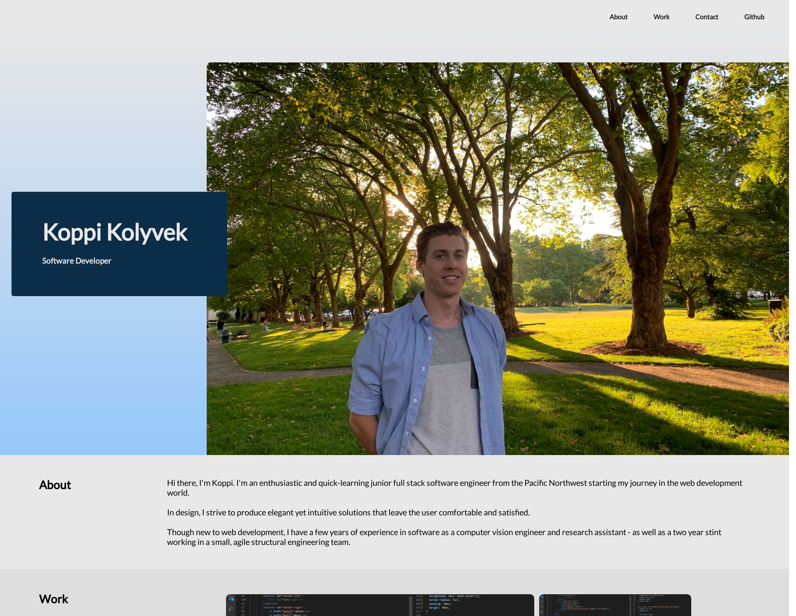

# Koppi's Online Portfolio

## Deployed Site: [Koppi Kolyvek's Portfolio](https://kkolyvek.github.io/kkolyvek-portfolio/)

 

## Description:

This repository contains the source code for Koppi Kolyvek's online portfolio. The site is built around CSS flex-boxes to allow for a pleasant experience at any browser dimension. Additionally, a slightly different layout is used for thinner browsers and mobile devices. The work section is currently filled with placeholders until more projects are developed.

The 'work' section features clickable image links that navigate to the deployed application (currently the placeholder links lead to this repo). The 'contact' section includes a fillable form that takes advantage of the user's default mail program.

 

## Preview of Site:

